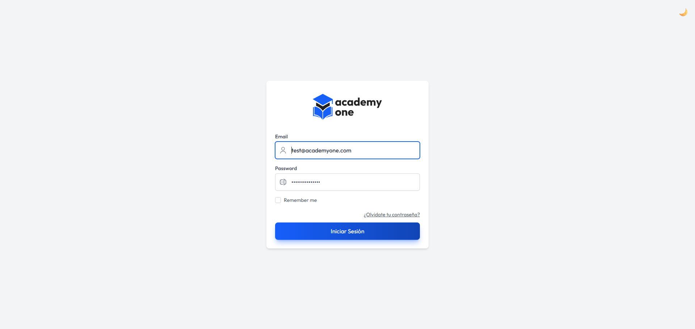
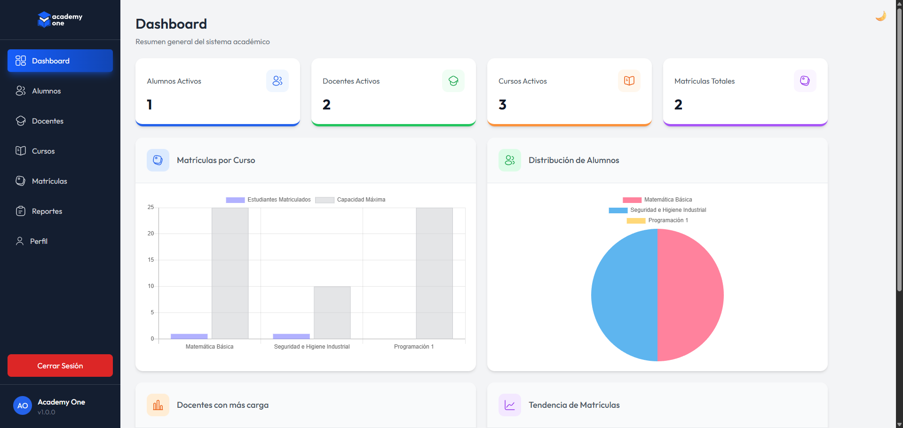
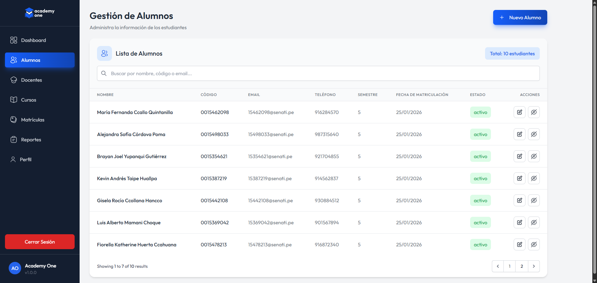

# Academy One - Sistema de Gestión Académica

Sistema académico completo para la administración de estudiantes, cursos, docentes y matrículas.
Desarrollado con Laravel + Blade + MySQL, siguiendo buenas prácticas de arquitectura MVC.

## Tabla de contenidos

  - [Capturas de pantalla](#capturas-de-pantalla)
  - [Stack tecnológico](#stack-tecnológico)
  - [Licencia](#licencia)
  - [Autor](#autor)

## Capturas de pantalla

## Stack tecnológico

### Backend
- [Laravel](https://laravel.com/)
- [MySQL](https://www.mysql.com/)

### Frontend
- Blade
- [Tailwind CSS](https://tailwindcss.com/)
- [Alphine.js](https://alpinejs.dev/)

## Licencia

El framework de Laravel es un software de código abierto licenciado bajo la [MIT license](https://opensource.org/licenses/MIT).

## Autor

**Daniel Villafranqui**
Frontend / Fullstack Developer  
🔗 Portafolio: https://portafolio-danvc.netlify.app
🔗 LinkedIn: https://linkedin.com/in/daniel-villafranqui  